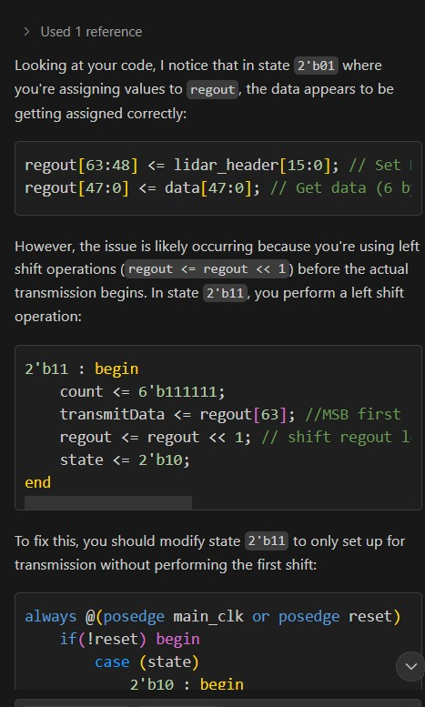
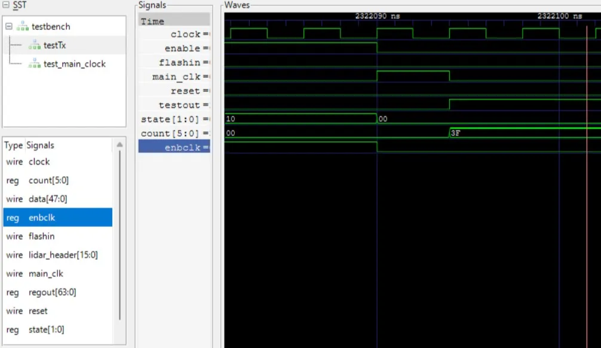

# AGV UART Task Documentation

# Receiver Module `newrdx.v`

## Idea-

So to start of with. It was decided that the receiver module, would be made first by running it on the baud clock itself(we decided this for all the components). Later we would go and change the clock to use a high frequency clock, and to scale that down to a UART type clock.

This was the initial idea of the Receiver module:

1. Take in the input, and ignore the first and last bit.
2. Take in the input address. In the case the input address is wrong, we ignore the rest of the bits till the sequence ends.
3. In the case where we don't ignore the bits, we create a system to send bytes, one byte at a time to the processing unit.

However at the end, this had to be changed to

1. Take in the input, ignore first and last bit.
2. Push out all the data in byte, including the address.

Hence the updated code, is a bit redundant, and has a few extra states than it needs to.

To communicate between the modules, a simpler communication protocol was used. This consisted of two pins. The data in pin, and the flash pin. The reason this was made this way, was to tell when to sample the data from the data line itself. The way this worked, is that the memory resister of the device would usually sample from the data in pin at every clock cycle. Once the data is actually ready, flash in is pulled HIGH for one clock cycle. This lets the next module know that the data is ready, and the FSM of the next device starts of with this.

To make this I also used 4 other external modules. One for creating an 3 bit counter, and one to act as an shift register that takes in data. The other two create a 115200 baud rate clock, and one to measure exactly half the time width of the baud rate.

## Inputs and Outputs

the inputs are-

1. `stream`- represents the input stream that the data comes from
2. `clock`- represents the main 100Mhz clock
3. `reset`- resets everything to a standard value

the outputs are-

1. `outstream`- 1 byte of info that is to be outputted to the processer.
2. `infodump`- this line gets pulled to high for once clock cycle, once the data to be taken into the Dx0 is finalized.

## Algorithm

we create FSMs for each part. We ignore the first and last bit. We use a register `MEMA` to store the value of the 2*length + 4. This can be used as a counter to ensure that we count till the function ends properly.  we use shift registers to get the small endian data into 8 bit chunks.

## Issues Faced

1. It was somewhat unintuitive as to what each state meant, when I used binary numbers. This was corrected in the other modules by using `localparam` to give each state a name.

```verilog
 reg [2:0]state; //0-> no bit 1-> entered into loop 1st 2-> entered into loop 3->getting length val 4->getting val 5->turning value indicator on 6->Stop conditon
    // for now if we dont get adress, we just play the game, assuming same structure of FS bits at the start;
    
   
  //coding like this and keeping the states in track like this became hard to do.
```

1. some of the registers often were too small to accommodate for the total memory of the device.
2. To ensure that the circuit is practically synthesizable,  we decided to make it such that, when the output was outputted, there would at least be one clock cycle between setting the data and putting the flash pin high.
3. Things got very complicated after the introduction of the main 100MHZ clock. The main issue was to implement an FSM that would wait for 1.5 times the clock cycle before sampling points. Another challenge was how to bifurcate tasks into those which ran during every clock cycle, and tasks that would only run on UART clock cycles. Another confusion for a long time was how instead of waiting of 1.5 clock cycles, the FSM waited for 0.5 clock cycles, which ended up changing the results to a great degree. There was also an issue with how we imported files, since we could not import the same module in two files, which branch up top(`RXD` and `TXD` both need the clock modules). 

```verilog
           if (state == 0) begin
                if (stream == 0 && !trig_clock && !trig_half) begin
                    trig_half <=1;
                end
                if (half_done == 1) begin
                    trig_half <=0;
                    trig_clock <=1;
                    clock_trig <=1;
                    infodump <= 1'b0;
                    state <= 1;
                end
                if (stream == 1 && !trig_half) begin
                    trig_half <=0;
                    trig_clock <=0;
                    clock_trig <=0;
                    infodump <= 1'b0;
                end
            end
            if (infodump <= 1'b1) begin infodump <= 1'b0;info_pulse<= 1'b0; end
            // this code was used to manage the timing to sample after one and a half cycles
```

1. This is more of a general Issue faced, but I will include it here…. We were unsure about what exact structure we should have followed for reset pins. What we ended up doing was to allow the reset pin to only take action at a positive clock edge. This would lower the odds of a random noise signal to change the state of our computation. However this also meant that, for modules like the shift register and clock, which would only run on the UART clock, the main clock pins were also included, just for the sake of resetting. 

```verilog
    always @(posedge trueclk && reset) begin
        out <={(MSB-1){1'b0}};
    end
    
	    // this sortof code was added to the counters and shift regsiters, even though in theory they never need to know about 
	    // the existence of a master clock to function
```

## Submodule`shift.v`

### shift register

The idea behind this was to create a device, that would store the first 8 bits in little endian order, and then push them out.  One issue that this module gave us was making sure that we got the order in the correct order after it was supposed to be pushed.

### Bit counter

standard bit counter to count to 8. This is very useful for the shift register as it would tell us when to measure from the shift register, and it could also be enabled by the enable pin, and could be turned on once the FSM starts.

# Processor Module`newdx.v`

## Idea-

This module would only run at the clock speed itself and would finish everything hopefully within one baud cycle.(Which it always will)

The idea behind the module is-

1. Take in all the values from the receiver. The first value is used to create a counter to take in those many values.
2. store all of these values within a array of registers.
3. after taking in all of them, loop through and find the minimum and max angle indexes
4. perform division to get the proper angle values
5. go through first 16 elements, or less than that, and calculate the obstacle detection bytes.

We had to use an additional module to create this, which was the division module. This was used to divide a 3 byte number with a one byte number. This was used to calculate min and max angle.

## Inputs and Outputs

the inputs are-

1. `clock`- represents the main 100Mhz clock
2. `datain`- This is the output of the receiver
3. `flashin` - We connect the flash out of the the receiver here
4. `reset`- resets everything to a standard value

the outputs are-

1. `lowest` - the lowest distance angle
2. `highest` - the highest distance angle
3. `hitvector` - contains obstacle alert data
4. `flashout` - the flash pin for this module

## Algorithm

the algorithm consists of the following parts….

1. the first number that comes in (after the header) is the length, so we store that within a variable. we use a counter to go through these many number of values, putting them into the memory. we assign the register `trimmedlength` to 16 if the length is greater than 16.
2. After this, we go through all the elements within memory, and iterate through all the elements trying to find the largest and smallest4
3. After this, we schedule the divider to find the value of max and min value
4. we go through a counter that counts up to `trimmedlength`, and after that calculate the obstacle detect for each one. 

## Issues Faced

1. Division is not synthesizable by nature, hence we had to make out own modules to do that.
2. There was an issue with ensuring memory actually made its way into the data list.
3. You are not able to have 2 changeable elements within a value expression. Hence we had to create a if statement condition to solve that. This popped up in this scenario

```verilog
// what I wanted to do
data[datastate[8:1]][{datastate[0],3{1'b1}},{datastate[0],3{1'b0}}]
//this is not realizable, and is illegal in verilog

//What I had to do at the end.
if (datastate[0]) begin
data[datastate[8:1]][15:8] <= datain;
end
else begin
data[datastate[8:1]][7:0] <= datain;    
end
```

## Other Modules`DIV.v`

We had to implement a division algorithm within a block , to calculate both angles. The algorithm of the division module is as follows:

1. we create an empty vector of 2 bytes, and start a clock that starts at 15(lets say its called B).
2. we then check if dividend≥(divisor<<B). 
3. If yes we perform dividend = dividend - divisor<<B, and we set the Bth bit of the empty vector to 1.
4. repeat this loop B becomes 0.

We had one issue implementing this, which was that the output was slightly off from the input in certain cases. This was solved by realizing the code checked or  dividend>(divisor<<B) and not dividend≥(divisor<<B).

```verilog
        if (!reset) begin
            case (state)
                IDLE: begin
                    flash <=0;
                    biginp <= big;
                    smallinp <= smal;
                    if (flash_inp) begin
                        state <= IVAL;
                    end
                    end
                IVAL: begin
                    if (biginp >= (smallinp<<counter)) begin
                        biginp <= biginp - (smallinp<<counter);
                        lessbig[counter] <= 1'b1;
                    end
                    if (counter == 0) state = FLAG;
                    else counter <= counter -1;
                end
                FLAG : begin
                    flash <= 1'b1;
                    counter <= 4'hF;
                    state <= IDLE;
                end

            endcase;
        end
        
        // shows the basic algorithm of the division algorithm
```

# Transmitter Module `txd.v`

## Working:

**The Transmitter Module should perform the following main functions:**

1. Have an input which enables the UART TX Process. Also a reset pin
2. Construct the UART message according to the format.
3. Get the header and the data to be transmitted from external registers.
4. Arrange the message such that:
    1. The header is sent first (0x55 0xAA).
    2. The data is sent after the header, with each part of the message in Little Endian form.
5. Setup an internal clock according to the baud rate (using a Timer module).
6. Transmit Data via UART to an output, (along with Start and Stop bits).

## Algorithm:

1. Made Internal registers for getting the data, count for transmission, and state for the FSM.
2. The FSM has 4 states: 
    1. 00 = Idle state = output pin pulled to high by default. it goes to 01 when flashin is high
    2. 01 = gets the data and header, and arranges the message. this process is done using the 100MHz clock. starts UART clock and goes to 11 afterward.
    3. 11 = gives the start bit (0). goes to 10 afterward 
    4. 10 = begin transmission - gives the message through the output pin.

## Issues Faced:

During implementation of Point 4, initially I had assigned a single register `reg [63:0] regout;` in which the message would be arranged. 

The output quantities of 2 bytes each from data were to be arranged into `regout` in Little Endian form, and by reversing the order of the 2 byte quantities during assignment and starting from the rightmost bit during transmission, I can achieve that. 

But the header was to be transmitted in the same order as it was stored, so it wouldnt have fit well into the above format. I tried the approach of :
appending header at start 
transmitting from the first bit `regout[63]`, right shifting till header sent
transmitting from last bit `regout[16]`, and left shifting till data sent

During debugging the output, i saw that the bit that was supposed to be first in regout was going to the last one.  


I scrapped the idea of including the start and stop bits in `regout` later 




But I could not find the cause of this error, so i decided to make another internal register `reg [15:0] headout;` for the header.

I found out later that the cause was an initial assignment before starting the counter (as the counter was one value less than number of transmissions, so i did one transmission before counter loop started)

I eventually got to know that the header was to be transmitted in Little Endian too, so I removed `headout` and did the whole process using only `regout`. Thus the errors and debug in this current heading were just a foolish chase.   

Also during debugging on the testbench module, i noticed that there was a small pulse (small because the normal high duration is 4340 times long) of `main_clk` just after its enable was turned off.  This was because the timer module took the value of enable that was just before the clock posedge, so it executed for that clock pulse.



Later I shifted the main clock module to the internal code of txd module, so now the problem does not have a negative effect on anything else.

# Other Modules:

## Timer Modules: `timer.v`

1. All timer modules have inputs of 100MHZ clock (T = 10ns), reset and enable.
2. The `main_clock` module starts with high for 434 clock cycles, and low for 434. The baud rate of the UART TX is taken to be 115200, translating to 8680.55 ns per bit.
3. The `ext_clock` module gives a clock 8x slower than `main_clock` .
4. The `timed_pulse` module gives a positive pulse once when turning on enable, of half the length of high of `main_clock` .

### Algorithm:

It is just a simple FSM consisting of 2 states - Idle and Enable. When enable pin is high, then it goes to Enable state, and starts the clock. The timing is maintained using a counter. 
The `main_clock` and `ext_clock` changes its high/low and updates the count at each half cycle. The `timed_pulse` just runs the counter once for every Idle to Enable state change.  

### Issues Faced:

We reached the end of module integration while still having a miscount in clock frequency by a factor of 10 :) 
Was using more states in the `timed_pulse` module than required, then simplified it as we proceeded 

# Testbench`testbench.v`

The testbench consists of a few basic things. 

1. Firstly we initialize the module, and connect basic wires to it
2. We define a clock that runs at 100MHz
3. We define another module to emulate the values you will end up seeing on the UART line

We initially reset the entire the device, and then proceed to send whatever inputs we want to send. The testbench is populated with 3 different sets of inputs we can provide, which can be used for testing.

```verilog
		reg [15:0]reg1 = 16'hAA55;
    reg [103:0]test1 = 104'h78452390782211CDAB9CA1FB04;
    reg [359:0]test2 = 360'h117512342000212111110FAB11ABABCD112312340310029903000ABCAAAAA0BC00AB00070008FBAD3311001114;
    reg [857:0]test3 = 856'h4761796461722041637469766174652E204761796461722073656E736520616D6F6E672075732E2E2E2E20486F742067617973206E65617220796F752E2077697468696E20312E35204B6D2E206E656172657374206761792061742037372064656772656573AA00110033;
    //reg reg1 is used to store the header. The following part are added on to create a legal UART messages
```

the final outputs looks like this:-


this shows the point where the input signal stops, and the output has to be pushed out. Notice the bitstream, 2nd to the bottom. this is the processing module doing all the math and giving the results within the time of one baud rate pulse.